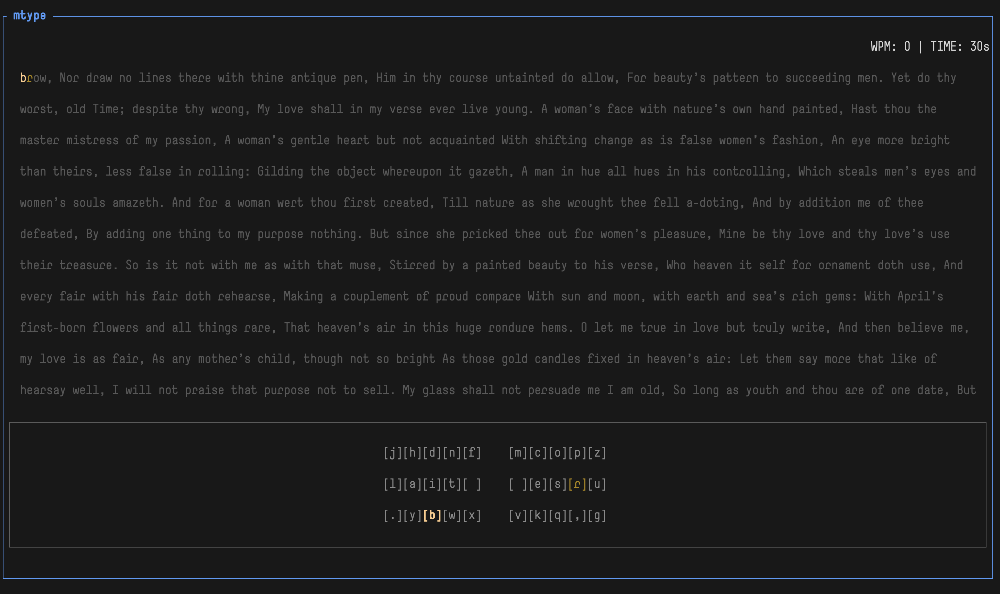

# mtype
A minimal terminal-based typing practice tool written in a single file using Rust with
[Ratatui](https://github.com/ratatui-org/ratatui).


---

## ✨ Features

- 📝 Practice with plain text or source code
- ⏱ Configurable timer
- 🚦 Timer starts on first keystroke
- ❌ Real-time error tracking
- 📍 Moving caret showing current typing position
- 🔄 Reset with `Esc`, quit with `Esc` again
- 📊 WPM-over-time line chart at the end
- 🎯 Proper code mode (preserves indentation, no justification)
- 🖥 Fully TUI-based (no GUI)

---

## 📦 Installation
```bash
# clone
git clone https://github.com/YOUR_USERNAME/mtype.git
cd mtype

# build
cargo build --release

# run
./target/release/mtype
```

### Set timer (seconds)

```bash
mtype -t 60
```

### Load a custom text file

```bash
mtype -f sample.txt
```

### Load a code file (left-aligned, indentation preserved)

```bash
mtype -c sample.rs
```

## 🛠 Built With

* Rust 🦀
* Ratatui
* Crossterm


## 🙌 Acknowledgements

Inspired by:
* monkeytype.com
* ratatui examples

