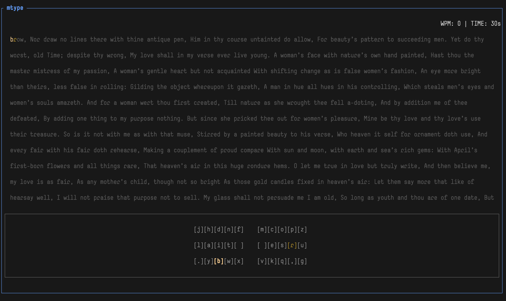

# mtype
A minimal terminal-based typing practice tool written in a single file using Rust with
[Ratatui](https://github.com/ratatui-org/ratatui).


---


## 📦 Installation
```bash
# clone
git clone https://github.com/YOUR_USERNAME/mtype.git
cd mtype

# build
cargo build --release

# run
./target/release/mtype
```

### Set timer (seconds)

```bash
mtype -t 60
```

### Load a custom text file

```bash
# pass a file
mtype -f sample.txt
# or simulate a file
mtype -f < (echo some text here)
```

### Load a code file (left-aligned, indentation preserved)

```bash
# for code files
mtype -c sample.rs
```

## 🛠 Built With

* Rust 🦀
* Ratatui
* Crossterm


## 🙌 Acknowledgements

Inspired by:
* monkeytype.com
* ratatui examples

