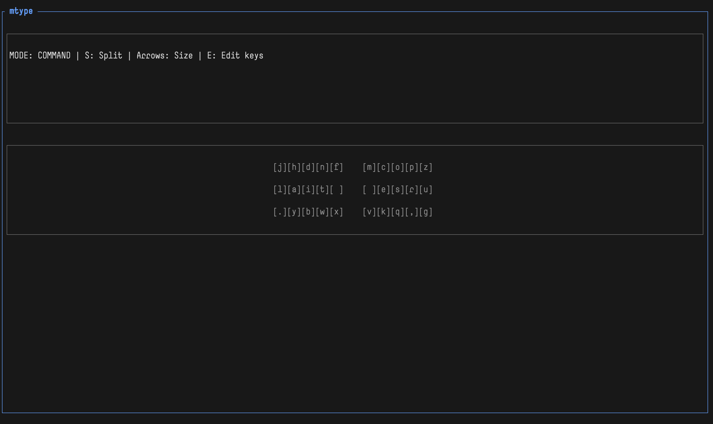

# mtype
A minimalist, high-performance terminal typing-practice tool built in Rust with [Ratatui](https://github.com/ratatui-org/ratatui).


### Why mtype?
I originally built **mtype** to practice touch typing on my **5-column split keyboard** using a custom layout.



### Features

  * **Customizable Layout Visualizer:** Define your own rows and columns to match your keyboard hardware.
  * **Split-Board Support:** Toggle a "split" view to better visualize left and right hand separation.
  * **Text & Code Modes:** Practice with literature or switch to Code Mode to maintain indentation and programming-specific syntax.
  * **Persistent Progress:** All runs are saved to a local SQLite database with WPM and Accuracy tracking.


### Installation

Ensure you have Rust and Cargo installed, then:

```bash
git clone https://github.com/adishourya/mtype.git
cd mtype
cargo install --path .
```

### Usage
Run the app with the default Shakespeare text:

```bash
mtype
```

Practice with a custom text file or code snippet:

```bash
mtype -f my_notes.txt      # Text Mode
mtype -f <(echo foo)       # or simulate a file
mtype -c my_script.py      # Code Mode (preserves indents)
```

Set a custom duration (in seconds):

```bash
mtype -t 60
```

